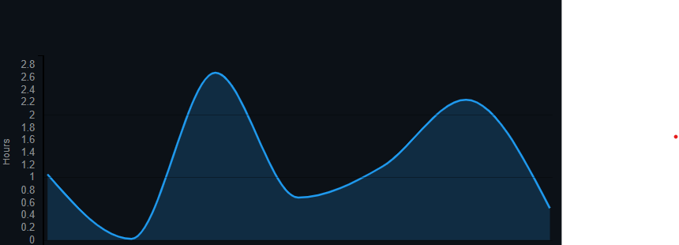
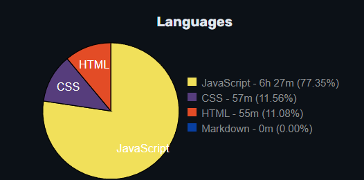

# Learn JavaScript from Apna College 🚀
<div align="right">

[](https://wakatime.com/badge/user/24cf1509-dfd7-4d4f-a090-e73a282d3353/project/b30c993e-2e15-475b-8e49-b77cf3f7522e)

</div>

This repository documents my journey of learning JavaScript through the **Apna College JavaScript Course**, covering concepts from beginner to intermediate levels. It includes hands-on practice and projects to strengthen my understanding of JavaScript fundamentals and web development.

---

## 🧠 Topics Covered in Lectures (1–13) 

### Lecture 1: **Javascript Varible & DataTypes **  
- Variables (`var`, `let`, `const`).  
- Data types: Numbers, Strings, Booleans, Undefined, and Null.  

### Lecture 2: **Operators and Conditions**  
- Arithmetic, Assignment, and Comparison operators.  
- Logical operators and their use cases.
- `if`, `else`, `else if`, and `switch` statements. 

### Lecture 3: **Loops & Strings JavaScript**  
- `for`, `while`, and `do-while` loops.  
- `break` and `continue` keywords.  

### Lecture 4: **Arrays**  
- Creating and accessing arrays.  
- Array methods: `push()`, `pop()`, `shift()`, `unshift()`, `slice()`, `splice()`.

 ### Lecture 5: **Functions & methods in JavaScript**  
- Function declaration and invocation.  
- Parameters and return values.  
- Arrow functions (`=>`).  

### Lecture 6-7: **DOM Manipulation**  
- Selecting elements using `getElementById`, `querySelector`.  
- Changing element content and style.  
- Event handling with `addEventListener`.  

### Lecture 8: **JavaScript Events**  
- Mouse events (`click`, `dblclick`, `mouseover`).  
- Keyboard events (`keydown`, `keyup`).

 ### Lecture 9-10: **Projects**  
- Tic Tac Toe Game
- Rock Paper Scissors Game

 ### Lecture 11: **Classes & Objects in JavaScript**  
- Defining objects and accessing properties.  
- Nested objects.  
- Methods inside objects.  

### Lecture 12: **Asynchronous JavaScript**  
- `setTimeout` and `setInterval`.  
- Introduction to Promises and `async/await`.  

### Lecture 13: **Final Project Concepts**  
- Currency Converter Project
- Integrating HTML, CSS, and JavaScript for interactive applications.  
- Debugging and improving code quality.  

---
## 📂 Repository Overview  

### Projects:
1. **Tic Tac Toe** 🎮  
   - **Description:** A two-player game with an interactive interface, allowing players to alternate turns and check for a winner or draw.  
   - **Technologies Used:** JavaScript, HTML, CSS  
   - **Folder:** [`TicTacToe`](./TicTacToe)  

2. **Rock Paper Scissors** ✊✋✌️  
   - **Description:** A classic game where the user competes against the computer, with randomized computer choices and real-time result tracking.  
   - **Technologies Used:** JavaScript, HTML, CSS  
   - **Folder:** [`RockPaperScissors`](./RockPaperScissors)  

3. **Currency Converter** 💱  
   - **Description:** A dynamic application for converting currencies in real-time using exchange rates.  
   - **Technologies Used:** JavaScript, HTML, CSS  
   - **Folder:** [`CurrencyConverter`](./CurrencyConverter)  

---

## 🛠️ Tech Stack

- **Languages:** JavaScript, HTML, CSS  
- **Tools:** Visual Studio Code, Live Server  

---

## 🔧 How to Run Projects

1. **Clone the repository:**
   ```bash
   git clone https://github.com/mahiamOmO/Learn-JavaScript-from-Apna-College.git
   cd Learn-JavaScript-from-Apna-College


## Coding Activity

<div style="display: flex; justify-content: space-between; align-items: center;">
  
  
</div>


